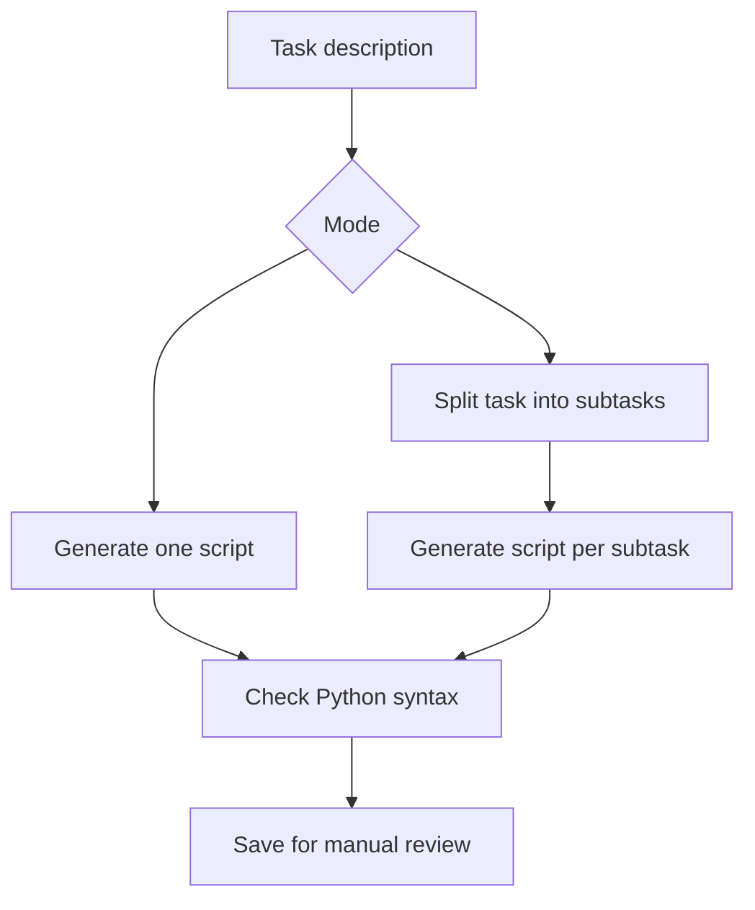

# AutoFlow

A Python CLI prototype that turns natural-language tasks into Python scripts using an OpenAI model. Built by Abdelrahman Elbaz.

## How it works



| Mode | Behavior |
| --- | --- |
| `basic` | Generates and displays one script; asks before saving `generated_script.py`. |
| `agents` | Decomposes a task and saves numbered scripts under `agents/`. |

The `agents` mode generates separate scripts. It does not coordinate their execution or define shared inputs and outputs.

## Quick start

Requires Python 3.10+ and an OpenAI API key with access to the selected model.

```bash
python -m venv .venv
# macOS / Linux
source .venv/bin/activate
# Windows PowerShell: .venv\Scripts\Activate.ps1
pip install -r requirements.txt
```

Copy `.env.example` to `.env`, set `OPENAI_API_KEY`, and optionally change `OPENAI_MODEL` (default: `gpt-4`). API usage may incur charges.

```bash
python main.py --task "Read a CSV and calculate average salary" --mode basic
python main.py --task "Read a CSV and filter high salaries" --mode agents
```

## Scope and limitations

- Removes outer Markdown fences and checks Python syntax before saving.
- Accepts numbered or bulleted subtask lists; rejects empty responses and truncated model output.
- Generated scripts are never executed by AutoFlow. Review them before running.
- Syntax validation does not prove correctness, security, dependency availability, or production readiness.
- No sandbox, execution orchestrator, or automatic functional evaluation is included.
- Reusing output names can overwrite earlier generated files; keep copies you need.

## Files

- `main.py`: command-line interface and output handling.
- `prompts.py`: task and code-generation prompts.
- `utils.py`: model calls, syntax checks, and subtask parsing.
- `.env.example`: configuration template; `.env` is ignored by Git.

## License

MIT. See `LICENSE`.
